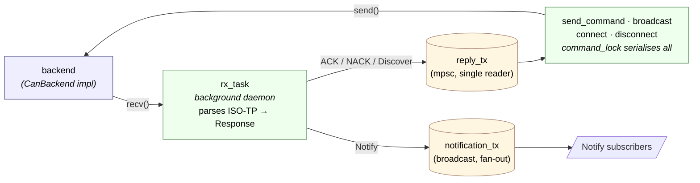

# Architecture

How the code fits together. Read [REQUIREMENTS.md](REQUIREMENTS.md) for **what**
the tool must do; read this for **how** it is built today. Delivery sequencing
lives in [ROADMAP.md](ROADMAP.md).

## The shape of the repo

One Rust engine, three shipped surfaces, one version:

```
can_flasher (Rust library)          ← everything below lives here
├── can-flasher      (binary)       ← the CLI
├── apps/can-studio  (Tauri 2)      ← MingoCAN, the desktop app
└── editor/vscode    (TypeScript)   ← the VS Code extension
```

**MingoCAN is the primary surface**, and it consumes the engine as a **path
dependency** — no shelling out, no JSON parsing, no serialisation boundary. A
Tauri command calls the same `Session` and `FlashManager` the CLI does. This is
the single most important structural fact about the codebase: there is one
implementation of the protocol, and both GUI and CLI are thin skins over it.

The VS Code extension is the exception — it *does* shell out, because it ships
independently and may target any `can-flasher` binary the user has installed.

---

## Module tree

```
src/
  lib.rs                 pub mod declarations — the library surface
  main.rs                clap entry point, exit-code mapping
  logging.rs             tracing bootstrap
  app_control.rs         app-level (non-bootloader) commands, e.g. reboot-to-BL
  bootloader_fetch.rs    bootloader artifact retrieval        [feature = "swd"]
  logfs_client.rs        LOGFS session driver: list / read / finalize

  cli/
    mod.rs               Cli + GlobalFlags + ExitCodeHint
    adapters.rs          list detected backends
    discover.rs          bus scan + device table
    flash.rs             end-to-end programming
    verify.rs            readback CRC compare
    diagnose.rs          DTC / log / live-data / health / reset
    config.rs            NVM + option bytes + WRP
    provision.rs         role → node-id write + reset
    logs.rs              microSD car-data log pulls
    pit_diag.rs          telemetry observer (listen / enable / stream)
    send_raw.rs          single raw frame
    replay.rs            candump record/play
    swd_flash.rs         first-boot via ST-LINK             [feature = "swd"]

  protocol/              wire format, zero I/O
    mod.rs               CanFrame + ParseError
    ids.rs               FrameId + MessageType
    opcodes.rs           Command / Notify / Nack codes
    isotp.rs             ISO-TP segment + reassemble
    records.rs           FirmwareInfo / Health / Live / Dtc / ObStatus
    commands.rs          typed payload builders
    responses.rs         Response::parse
    logfs.rs             LOGFS opcodes + record layouts

  transport/             adapter I/O behind an async trait
    mod.rs               CanBackend trait + open_backend router
    virtual_bus.rs       in-process loopback
    stub_device.rs       bootloader simulator
    slcan.rs             all OSes
    socketcan.rs         Linux only
    pcan.rs              Windows + macOS
    vector.rs            Windows XL Driver Library
    isolation.rs         out-of-process backend host (see below)

  session/mod.rs         handshake + keepalive + reconnect
  firmware/              Image + address validation; ELF / Intel HEX / .bin
  flash/mod.rs           FlashManager state machine
  swd/mod.rs             probe-rs driver                     [feature = "swd"]

  pit_diag/              telemetry decoders
    mod.rs               AMS observer (0x680–0x6CA)
    ecu.rs               ECU observer (0x700–0x708)
    udv.rs               uDV observer (0x7A0–0x7A9)
    testdata/            vendored DBC snapshots + PROVENANCE.txt
```

`apps/can-studio/src-tauri/src/` mirrors the CLI's subcommand split as Tauri
commands — `flash.rs`, `diagnose.rs`, `logs.rs`, `pit_diag.rs`, `provision.rs`,
`swd.rs` — and adds two modules with no CLI equivalent: `bus_monitor.rs` and
`dbc.rs`.

---

## Layers, bottom to top

### 1. `protocol/` — wire format, zero I/O

Pure byte-shuffling and state machines. No transport dependencies, no `tokio`
types, nothing platform-specific. Every layout and constant matches the
bootloader's `bl_proto.h` / `bl_isotp.h` / `bl_fwinfo.h` / `bl_health.h` /
`bl_live.h` / `bl_dtc.h` / `bl_obyte.h` **byte-for-byte**. This is the one place
to change if the wire format drifts.

Two policies for enums, split by whether we emit them or only receive them:

- **Strict** (`#[repr(u8)]` + `TryFrom<u8>`) — `CommandOpcode`, `NotifyOpcode`,
  `ResetMode`. We never emit outside the known list, so an unknown byte at parse
  time is a version-skew signal and we surface it loudly.
- **Lenient** (`Unknown(u8)` fallback) — `NackCode`. A future bootloader that
  adds a NACK code should land in the host's logs readably rather than crashing
  the flasher.

`IsoTpSegmenter` is a stateless iterator over 8-byte frames; `Reassembler` is a
state machine with `feed(frame, now_ms)` + `tick(now_ms)`. The bootloader's
conventions — the FF keeps the original `MessageType`, CFs travel as
`TYPE=DATA` — are documented in `isotp.rs`'s module comment.

### 2. `transport/` — adapter I/O behind an async trait

`CanBackend` is an `async-trait` with `send` / `recv` / `set_bitrate` /
`bus_load` / `has_hw_timestamps` / `description`. Callers consume
`Box<dyn CanBackend>`, so nothing above this layer knows which adapter is
moving frames.

| Backend | Platform | Wire | Notes |
|---|---|---|---|
| `VirtualBackend` | all | in-proc `mpsc` | Paired into `VirtualBus` for testing; `StubLoopback` packages it with a `StubDevice` for `--interface virtual`. |
| `SlcanBackend` | all | USB CDC serial | SLCAN ASCII (`t` frames, `S<N>` bitrate, `O`/`C`) via `serialport`. Blocking reader thread + `tokio::sync::mpsc`. |
| `SocketCanBackend` | Linux | `AF_CAN` socket | `socketcan` crate with `tokio`. Also serves `--interface pcan` on Linux, since `peak_usb` exposes PCAN as SocketCAN. |
| `PcanBackend` | Windows / macOS | PCAN-Basic SDK | `libloading` resolves `PCANBasic.dll` / `libPCBUSB.dylib` at runtime. Missing SDK → `AdapterMissing`, not a link error. |
| `VectorBackend` | Windows | XL Driver Library | `libloading` resolves `vxlapi64.dll`; same fail-soft behaviour. Channels via `xlGetDriverConfig`; the CLI takes a 0-based XL index. |

`open_backend` is the router: `InterfaceType` + optional channel + bitrate →
`Box<dyn CanBackend>`. Platform gating lives there so the rest of the code stays
platform-agnostic. `TransportError` covers `Timeout` / `Disconnected` / `Io` /
`InvalidChannel` / `AdapterMissing` / `Other`.

#### `isolation.rs` — running a backend out-of-process

Some native driver libraries fault on **their own threads**, where no
in-process Rust code can catch it. The confirmed case: macOS MacCAN
`libPCBUSB` SIGBUSes on its internal IOKit run-loop thread when the adapter is
unplugged — taking the whole MingoCAN window down over a fault entirely inside a
third-party driver.

`IsolatedBackend` runs the crash-prone backend in a **separate helper process**
— this same binary re-invoked as the hidden `__can-host` subcommand — and
bridges frames over stdio. If the driver faults, only the helper dies; the
parent sees the pipe close and reports `Disconnected`. The app survives and
shows "adapter disconnected".

Only the native FFI backends need this. SLCAN already errors cleanly on a serial
unplug, and SocketCAN is in-kernel; both stay in-process.

### 3. `session/` — handshake, keepalive, notifications

One `Session` on top of `CanBackend`, owning the boilerplate every subcommand
would otherwise open-code:

- ISO-TP segmentation on TX.
- ISO-TP reassembly on RX in a **single background task** that owns the only
  read path into the backend. It captures `MessageType` from the SF/FF (CFs ride
  as `TYPE=DATA`) and routes completed `Response`s: `Ack` / `Nack` / `Discover`
  to an `mpsc` with one receiver, `Notify` to a `broadcast` with any number.
- `CONNECT` handshake with protocol-version validation.
- A 5 s keepalive issuing `CMD_GET_HEALTH` to refresh the bootloader's 30 s
  session watchdog.
- Reconnect on `NACK(BAD_SESSION)`, under the same lock, so concurrent
  operations cannot interleave mid-reconnect.
- Teardown: `disconnect()` sends `CMD_DISCONNECT` and aborts the RX task; `Drop`
  does a best-effort version without being able to `.await`.



Exactly one command is in flight at a time — `command_lock` serialises
`send_command`, `broadcast`, `connect`, `disconnect`, and the reconnect path.

### 4. Application layers on top of a session

`flash/` holds the `FlashManager` state machine — the diff / erase / write /
verify / commit pipeline. `firmware/` parses ELF, Intel HEX and raw binaries
into an `Image` and validates its target addresses against the protected
regions. `logfs_client.rs` drives the LOGFS session for log pulls.

`pit_diag/` is different in kind: it decodes **broadcast telemetry**, not a
session. There is no handshake and no request/response — boards emit frames and
the decoders turn them into typed structs. `mod.rs` covers the AMS, `ecu.rs` the
ECU, `udv.rs` the uDV. See [The DBC problem](#the-dbc-problem) below.

### 5. `cli/` — subcommand implementations

Thin wrappers. Each one parses its args via `clap`, opens a backend, wraps it in
a `Session` if it needs one, issues commands, and formats the result as a table
or as JSON.

Twelve subcommands ship today: `adapters`, `discover`, `flash`, `verify`,
`diagnose`, `config`, `provision`, `logs`, `pit-diag`, `send-raw`, `replay`, and
`swd-flash` (behind `--features swd`). A new one is typically a few hundred
lines including its JSON formatter and a `tests/*_subcommand.rs` integration
test.

### 6. `main.rs` + `lib.rs` — binary and library targets

`lib.rs` declares the tree as `pub mod`; `main.rs` consumes it via
`can_flasher::…`, parses args, dispatches, and maps `anyhow::Error` to the exit
codes in [docs/CLI.md § Exit codes](docs/CLI.md#exit-codes).

The split earns its keep three times over:

1. **Integration tests** in `tests/` can only reach crate-library exports.
2. **MingoCAN** depends on the library by path — this is what makes the desktop
   app a first-class consumer rather than a wrapper that shells out.
3. **Future Rust consumers** get typed access without buying into `clap`.

---

## Design notes

### The DBC problem

`pit_diag/`'s decoders are **hardcoded**: fixed IDs, fixed frame counts,
per-field bit positions, enum value tables. That is deliberate — it is fast and
produces richly-typed structs the UI can consume directly. The risk is equally
real: the firmware changes the wire and the host silently mis-decodes.

Two mechanisms address it, and both are needed:

**Conformance tests** (`tests/ecu_dbc_conformance.rs`,
`tests/pitdiag_dbc_conformance.rs`) assert the decoders' assumptions against a
**vendored DBC snapshot** — the firmware repos' generated `.dbc` is the source
of truth for the wire. They assert *complete signal sets*, so an upstream
**addition** fails the suite too, not just a change.

**The drift watch** (`.github/workflows/ecu-dbc-drift.yml`) exists because the
conformance tests have a blind spot by construction: they check the decoder
against the *snapshot*, so they can only fail once somebody re-vendors it.
Nothing in this repo changes when the ECU wire moves. The workflow diffs the
snapshot against the upstream repo daily and keeps one issue in sync.

> It is `schedule`-triggered, so it only runs from the **default branch**.
> Merging such a workflow to `dev` is not enough — it stays dormant until the
> next release reaches `main`.

Six decode drifts accumulated behind that gap before it existed.

### Why `async-trait`?

`CanBackend` has async methods and is consumed as `Box<dyn CanBackend>`. Native
`async fn` in traits still requires desugaring to `Pin<Box<dyn Future>>` for
`dyn`-compatibility — exactly what `async-trait` does. One allocation per call,
no bespoke machinery. If stable Rust ever ships dyn-safe async fn without the
allocation, this becomes a one-line `use` removal.

### Why `mpsc` for the virtual bus instead of `broadcast`?

Classic CAN is a broadcast bus, but the mock uses **two `mpsc` channels** (host
→ device, device → host):

1. A broadcast channel lets a node see its own transmissions bounce back, so
   we'd need per-node self-filtering. Extra complexity that isn't earning its
   keep at two nodes.
2. `broadcast` silently drops frames for a slow receiver. `mpsc` surfaces that
   as a `TrySendError` we can map to a real `TransportError`.

Multi-device virtual-bus tests (1 host + N stubs) would want a
`VirtualBus::broadcast_backend(node_id)` layering filtering on top of a
`broadcast` channel, leaving the 2-node path as a shortcut.

### Why runtime dynamic loading for PCAN and Vector?

Both SDKs are proprietary. Link-time dependency would force every user to
install PEAK's or Vector's libraries before the tool even starts — tolerable for
users of those adapters, absurd for everyone else. `libloading` resolves the
library at the moment the backend is requested.

Search order, PCAN: `$PCAN_LIB_PATH`, then the platform default (`PCANBasic.dll`
via the OS search path on Windows, `/usr/local/lib/libPCBUSB.dylib` on macOS),
then the directory containing the running binary. Vector is the same shape:
`$VECTOR_LIB_PATH`, then bare `vxlapi64.dll` (the installer's System32 copy),
then the binary's directory. Either missing surfaces as `AdapterMissing` with
the vendor's download URL.

Vector has one extra wrinkle: the XL Driver Library's `XLchannelConfig` struct
has changed layout across SDK releases. `vector.rs` treats the config buffer as
opaque bytes and reads only the fields it needs at documented offsets;
`XL_CHANNEL_CONFIG_SIZE` is the single tunable if a future SDK shifts the slot
stride. Enumeration filters on `channelBusCapabilities & XL_BUS_ACTIVE_CAP_CAN`
so a multi-bus device like the VN1640 reports only its CAN channels.

Vector on Linux needs a separate backend rather than routing through
SocketCAN — Vector's Linux driver does not expose adapters as SocketCAN
interfaces the way PCAN's `peak_usb` does.

### Why `cfg`-gated platform modules?

`socketcan.rs` is `#![cfg(target_os = "linux")]`, `pcan.rs` is
`#![cfg(any(windows, macos))]`, `vector.rs` is `#![cfg(target_os = "windows")]`.
One file with inline `#[cfg]` everywhere would bloat each backend with
platform branches and stop contributors reading one in isolation. The cost is
one extra dispatch arm in `open_backend`.

### Why `command_lock` serialises commands?

A CAN bus is shared and a bootloader session has one `session_active` latch.
Neither supports concurrent commands: the bootloader would interleave responses
and we would have to match replies to requests by opcode, with all the
duplicate-opcodes-in-flight edge cases that implies.

Serialising at the session layer matches physical reality. A caller who wants
concurrency — multi-node flash — spawns one task per node, each with its own
`Session` and its own lock.

---

## Testing

**Unit tests** live in-file as `#[cfg(test)] mod tests`. The pure modules
(protocol, session) carry the bulk of the count.

**Integration tests** under `tests/`, thirteen files:

| Test | Covers |
|---|---|
| `virtual_pipeline.rs` | End-to-end `VirtualBus` + `StubDevice` + `Session` — frame IDs, ISO-TP both ways, response parsing, handshake, broadcast |
| `flash_manager.rs` | The flash state machine in isolation |
| `logfs_pipeline.rs` | LOGFS list / read / finalize round trips |
| `isolation_host.rs` | The out-of-process backend bridge |
| `reboot_to_bootloader.rs` | The app-level reboot trigger |
| `ecu_dbc_conformance.rs`, `pitdiag_dbc_conformance.rs` | Decoders vs. vendored DBC snapshots |
| `*_subcommand.rs` | One per CLI subcommand, some spawning the real binary via `CARGO_BIN_EXE_can-flasher` |

**CI** (`ci.yml`) runs `rustfmt --check`, `clippy --all-targets --all-features
-D warnings` on Linux (which reaches the `socketcan` cfg path macOS and Windows
cannot), and build + test across Linux, macOS and Windows. Linux needs
`libudev-dev` + `pkg-config` for `serialport`'s USB enumeration. The app and the
extension have their own workflows (`can-studio-ci.yml`, `editor-ci.yml`).

**Hardware-in-the-loop is not automated.** A real SLCAN backend needs a CANable,
SocketCAN needs a kernel interface, PCAN needs a PEAK adapter and its SDK. These
are covered by a manual smoke test: plug in, confirm `can-flasher adapters` sees
it, then run a full flash / discover / diagnose cycle.

---

## Deferred

Matches [REQUIREMENTS.md § Deferred scope](REQUIREMENTS.md#deferred-scope-v2-tied-to-bootloader-phase-5).
These land if the bootloader reactivates its Phase 5 security work:

- Ed25519 firmware signing (`sign` / `keygen`)
- Monotonic replay counter
- Challenge-response session auth (adds `CMD_AUTH` wire surface)
- Optional AES-128-CTR transport encryption
- Device-UID-based identity

Nothing in the layout precludes these — `Session` has pre-command and
post-response hooks that can carry signatures and nonces.

---

## Where to start reading

| Goal | Start at |
|---|---|
| The wire format | `src/protocol/isotp.rs`'s module comment, then `opcodes.rs` |
| Adding a backend | `src/transport/slcan.rs` (simplest); `pcan.rs` / `vector.rs` if it's a proprietary SDK behind `libloading` |
| Adding a subcommand | `src/cli/adapters.rs` (shortest); `src/cli/discover.rs` (the canonical open-backend-drive-session-format template) |
| Changing CLI args | `src/cli/mod.rs` owns the `clap` types; each subcommand has its own `*Args` |
| The desktop app | `apps/can-studio/src-tauri/src/lib.rs` for the command surface, then the matching module |
| A new protocol feature | `tests/virtual_pipeline.rs` plus the relevant module's unit tests |
| Why a decoder drifted | `tests/ecu_dbc_conformance.rs` and `src/pit_diag/testdata/PROVENANCE.txt` |
